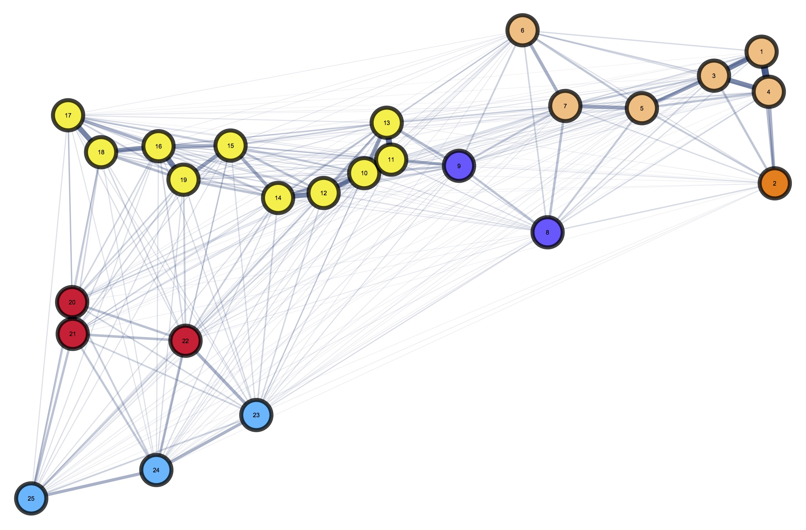

# Visualizacion:MLQB
Ejemplo de clase
#**Título del ejercicio**
##**Subtítulo**
###**Ejemplos**
Ordered lists:
Elementos importantes a considerar en la evaluación
1.Tareas  
2. Quizzes
3. Exámenes parciales
...

| Tables        | Are           | Cool  |
| ------------- |:-------------:| -----:|
| Manzana       | roja          | $1600 |
| limón         | verde         |   $12 |
| fresa         | roja          |    $1

